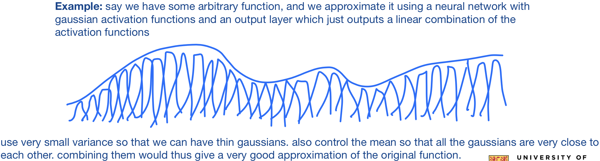
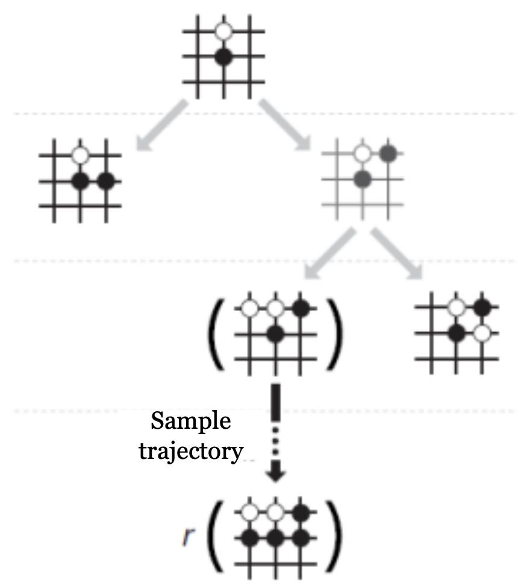
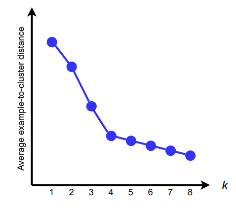

## lec2
### Calculate Joint Probability Using the Chain Rule

$$
\begin{align*}
P(A_n, A_{n - 1}, \ldots, A_2, A_1) &= \prod_{i = 1}^n P(A_i \mid A_{i - 1} \land \dots \land  A_1) \\
&= P(A_n \mid A_{n-1}, A_{n-2}, \ldots, A_1) \cdot P(A_{n-1} \mid A_{n-2}, \ldots, A_1) \cdot \ldots \cdot P(A_2 \mid A_1) \cdot P(A_1) 
\end{align*}
$$

### Cool Bayes Rule trick

Don't need to know $P(Y)$ to compute $P(X \mid Y)$. $P(Y)$ is simply a normalization constant. We can calculate $P(X \mid Y)$ and $P(\neg X \mid Y)$ and then normalize them to sum to $1$


### Calculating Probabilities

A universal approach
1. To calculate a conditional probability, convert it into a fraction of two joint probabilities using the product rule in reverse.
2. To calculate a joint probability (not involving all the variables), write it as a summation of joint probabilities (involving all the variables) by introducing the other variables using the sum rule in reverse.
3. Calculate every joint probability (involving all the variables) using the chain rule.

## lec3

### Unconditional Independence

$X$ and $Y$ are unconditionally independent if
- $P(X \mid Y) = P(X)$ 
- $P(Y \mid X) = P(Y)$
- $P(X \land Y) = P(X) \cdot P(Y)$

need to make 4 comparisons

### Conditional Independence

$X$ and $Y$ are conditionally independent given $Z$ if
- $P(X \mid Y \land Z) = P(X \mid Y)$
- $P(Y \mid X \land Z) = P(Y \mid X)$
- $P(X \land Y \mid Z) = P(X \mid Z) \cdot P(Y \mid Z)$

need to make 8 comparisons

**Note**: Independence does not imply conditional independence, and vice versa.

### Bayesian Networks

- Directed Acyclic Graph
- Each node is a random variable - can be continuous or discrete
- Represents conditional dependencies
- If an arrow is from $X$ to $Y$, then $X$ has a direct influence on $Y$
- **Markov Blanket**: a set of neighbouring variables that directly effect the variable $X$'s value. given this set of variables, $X$ is conditionally independent of all other variables.

Representing the joint distribution

$$P(X_n \land \dots \land X_1) = \prod_{i = 1}^n P(X_i \mid \text{Parents}(X_i))$$

### Three Key Structures

#### Structure 1


- Burglary and Watson are not independent
	- if Burglary is happening, Alarm is more likely to go off, meaning that Watson is more likely to call.
- Burglary and Watson are conditionally independent given Alarm

#### Structure 2


- Watson and Gibbon are not independent
	- If Watson is more likely to call, Alarm is more likely to go off, meaning that Gibbon is more likely to call.
- Watson and Gibbon are conditionally independent given Alarm

#### Structure 3


- Earthquake and Burglary are independent
- Earthquake and Burglary not conditionally independent given Alarm
	- Assume Alarm is going off. If Earthquake did cause it, less likely Burglary is also happening. If Burglary caused it, less likely Earthquake is also happening.


## lec4

### D-Separation

$E$ d-separates $X$ and $Y$ iff $E$ blocks all undirected paths between $X$ and $Y$.

if $E$ d-separates $X$ and $Y$, then $X$ and $Y$ are conditionally independent given $E$.

### Blocked Paths

There are a few scenarios to consider while checking for blocked undirected paths
#### Scenario 1


#### Scenario 2


#### Scenario 3


### Constructing Bayesian Networks

- For a joint probability distribution, there are many correct Bayesian networks.
- Given a Bayesian network A, a Bayesian network B is correct if and only if the following is true: If Bayesian network B requires two variables to satisfy an independence relationship, Bayesian network A must also require the two variables to satisfy the same independence relationship.
- We prefer a Bayesian network that requires fewer probabilities.

**Important**
- Bayesian network B could miss independence from Network A, but it cannot miss dependence.

#### Steps
- Order the variables $\{X_1, X_2, \dots, X_n\}$
- For each variable $X_i$ in order:
	- Pick the smallest subset $\text{Parents}(X_i)$ from $X_1, \dots, X_{i - 1}$ such that given $\text{Parents}(X_i)$, $X_i$ is independent from all variables $\{X_1, X_2, \dots, X_n\} - \text{Parents}(X_i)$
	- Create a link from each of $\text{Parents}(X_i)$ to $X_i$
	- Compute table for $P(X_i \mid \text{Parents}(X_i))$

### Important Notes about Bayesian Networks (from Alice Gao's videos)

- Not every link in the Bayesian network is representing a causal relationship
- For the original Bayesian network for the home scenario, it just so happens that the network was constructed in a way such that the causes were added before the corresponding effects, so all of the links represented causal relationship - however, this is not generally the case
- All of the links in bayesian networks can be reversed, so every link is representing some correlation, but NOT necessarily a causal relationship
- Changing the order of the variables while constructing bayesian networks can lead to having more/less links in the network. More links = bad = more complicated
- A general hand wavy rule that can be used to construct a compact Bayesian network is to pick a variable ordering that respects the causal relationship, so if there’s a causal relationship between nodes, always try add the causes before you add the effects.

Finding the most compact Bayesian Network is **NP-hard**!

### Causality vs Correlation

correlation does not imply causation :)

There may exist hidden confounding variables that effect both the supposed cause and effect.

**Example**: Experiments/Studies show a strong positive correlation between children reading skills and shoe size. Why are these two variables so correlated?


Here, Age is a the confounding variable. The hidden variable Age confounds the relationship between Shoe Size and Reading.

#### Intervention

To determine if there is a causal relationship, the concept of intervention is used.

We intervene in the system to manipulate one variable and observe the effect on another variable.

#### Average Treatment Effect (ATE)

ATE Measures the average effect of a treatment (in this case, shoe size) on an outcome (reading skills) across a population.

$$\text{ATE} = \sum_A p (R \mid S = 1, A) p(A) - \sum_A p(R \mid S = 0, A) p(A)$$

By subtracting these sums, we obtain the ATE, which tells us the average effect of changing shoe size on reading skills, accounting for the distribution of age.

If $\text{ATE} \approx 0$, then there is an indication that shoe size does not have a causal effect on reading skills. The observed correlation is explained by the confounding variable, age, which affects both shoe size and reading skills independently.

## lec5

### Supervised Learning

Two types of problems
- **Classification**: target features are discrete
- **Regression**: target features are continuous

**No free lunch theorem**: In order to learn something useful, we have to make some assumptions — have an inductive bias.

How do we choose a hypothesis that generalizes well? One that predicts unseen data correctly?
- **Ockham’s razor**: prefer the simplest hypothesis consistent with the data
- **Cross-validation**: a more principled approach to choose a hypothesis

#### Biase Variance Tradeoff:


**Bias**: If I have infinite data, how well can I fit the data with my learned hypothesis

A hypothesis with a high bias 
- makes strong assumptions
- is too simplistic
- has few degrees of freedom
- does not fit the training data well

Problem with high bias: if can't even capture training data well, how can we possibly predict unseen data well?

**Variance**: How much does the learned hypothesis vary given different training data?

A hypothesis with high variance
- has a lot of degrees of freedom
- is very flexible
- fits the training data well

Problems with high variance: overfitting


#### Bias Variance Equation

Let $\hat{f} = \hat{f}(x; D)$

$$
\begin{align*}
\text{MSE} = E_{D, E} [(y - \hat{f})^2] = (\text{Bias}_D [\hat{f}])^2 + \text{Var}(\hat{f}) + \sigma^2
\end{align*}
$$

where

$$
\text{Bias}_D[\hat{f}] = E[\hat{f}] - f(x)
$$

$$
\text{Var}_D[\hat{f}] = E(E[\hat{f}] - \hat{f}(x))
$$

Thus, overall

$$\text{total error} = \text{bias} + \text{variance} + \text{irreducible noise}$$


**Source**: Wikipedia :)

#### Cross-validation

Used for finding a hypothesis with low bias and low variance.

Used when we don't have access to test data – uses part of the training data as a surrogate for test data (called validation data). Use validation data to choose hypothesis
##### Steps
- Break data into $k$ equally sized parts
- Train a learning algorithm on $k - 1$ parts (training set)
- Test on the remaining $1$ part (validation set)
- Do this $k$ times, each time testing on a different partition
- Calculate the average error on the $k$ validation sets

In the end, we can either
- choose one of the $k$ trained hypotheses as the final hypotheses
- train a new hypothesis on all data – using parameters selected by cross validation

#### Overfitting


### Unsupervised Learning

#### K-means algorithm

Randomly select $k$ data points as initial centroids
- Assign each data point to the closest centroid.
- Re-compute the centroid using the current cluster memberships.
- If convergence is not met, repeat

#### Independent Component Analysis (ICA)

ICA is a unsupervised learning technique used to separate mixed signals into their independent sources.

**Example**: Cocktail party problem: listening in on one person's speech in a noisy room.

Let's say we observe data $x_i(t)$. We can model it using hidden variables $s_i(t)$:

$$x_i(t) = \sum_{j = 1}^m a_{ij} s_j(t) \quad\quad i = 1, \dots, n$$

where we assume
- the observed data $x$ has $n$ components 
- there are $m$ independent sources

or as a matrix decomposition

$$X = AS$$

where
- $a_{ij}$, or the matrix $A$ is a constant parameter called the *mixing parameter*
- $S$, or $s_j(t)$ are the hidden random factors, also called *independent components* or *source signals*

We estimate both $A$ and $S$ by observing $X$

**Good Resource**: [Geeks For Geeks page](https://www.geeksforgeeks.org/ml-independent-component-analysis/)

## lec6

### Activation Functions

Before we talk about commonly used activation functions, it is important to consider what makes up a *good* activation function!
- **Nonlinearity**: Complex relationships are often nonlinear. Combining linear functions will not give us a nonlinear function. We can interleave linear and nonlinear functions to represent complex relationships.
- **Mimic behaviour of real neurons**: If the weighted sum of the input signals is large enough, then the neuron fires (sends an output signal of 1). Otherwise, the neuron does not fire (sends an output signal of 0).
- **Differentiable (almost everywhere)**: We learn a neural network by using optimization algorithms like gradient descent. Many such optimization algorithms require a function to be differentiable.

With this in mind, let's look at some common activation functions

1. **Step Function**: $g(x)=1$ if $x > 0$ and $g(x)=0$ if $x < 0$
	- Simple to use, but not differentiable


2. **Sigmoid Function**:  $g(x) = \dfrac{1}{1 + e^{-kx}}$
	- For very large and very small $x$, $g(x)$ is close to $1$ or $0$
	- Approximates the step function. As $k$ is increased, the sigmoid function becomes steeper
	- Differentiable
	- Computationally Expensive


*Vanishing Gradient Problem*: when $x$ is very large or very small, $g(x)$ responds little to changes in $x$. The network does not learn further or learns very slowly

3. **ReLU function**: $g(x) = \max(0, x)$
	- Computationally efficient - network converges quickly
	- Differentiable


*Dying ReLU problem*:  When inputs approach $0$ or are negative, the gradient becomes $0$ and the model can't learn anything

4. **Leaky ReLU**: $g(x) = \max(0, x) + k \cdot \min(0, x)$
	- Small positive slope k in the negative area. Enables learning for negative input values


### Convolutional Kernel

- **stride (s)**: number of pixels to move
- **padding (p)**: 
- **filter (f)**: size of the kernel

$$
\text{Output dimensions} = \Bigg(\frac{i - f + 2p}{s} + 1\Bigg), \Bigg( \frac{j - f + 2p}{s} + 1 \Bigg)
$$

$$
\text{Parameter Size} = \text{input channels} \times \text{kernel size} \times \text{output channels}
$$

**Pro tip**: To visualize output, imagine sliding a $f \times f$ square top left to bottom right. How many times can you do this?

#### Example #1
We are processing an image of $32 \times 32 \times 3$. We use a kernel of size $5 \times 5$ with an output channel of $8$. We slide the window with a stride of $1$. What is the parameter size? What is the output dimension?

Thus, we have the following info:
- $i = 32$, $j = 32$
- input channels $= 3$
- kernel size $= 5$
- $s = 1$
- output channels $= 8$

$$
\text{Output dimensions} = \Bigg(\frac{32 - 5}{1} + 1\Bigg), \Bigg( \frac{32 - 5}{1} + 1 \Bigg) = (28), (28)
$$

$$
\text{Parameter Size} = 3 \times 5 \times 5 \times 8 = 600
$$
#### Example #2
Stack another convolutional layer of size $3 \times 3$ with a depth of $16$. We slide the window with a stride of $2$. What is the output dimension?

Thus, we have the following info:
- $i = 28$, $j = 28$ (using the output dimensions of prev question as input dimensions)
- kernel size $= 3$
- $s = 2$

$$
\text{Output dimensions} = \Bigg(\frac{28 - 3}{2} + 1\Bigg), \Bigg( \frac{28 - 3}{2} + 1 \Bigg) = (13.5), (13.5) = (13, 13) \quad
$$

*round down since there is no padding*

Since the depth is 16, the total number of neurons is $13 \times 13 \times 16 = 2704$


### Recurrent Networks

- We use RNNs when patterns in our data change with time
- Feeds outputs back into the model's inputs.
- Can support short-term memory. For the given inputs, the behaviour of the network depends on its initial state, which may depend on previous inputs.

$h_t = f_W(h_{t - 1}, x_t)$
$y_t = f_Y(h_t)$

$h_t = \tanh(W_{hh} h_{t - 1} + W_{xh} x_t)$
$y_t = W_{hy} h_t$


#### Example: Modelling Language

##### Training Stage


`vocabulary V=[h,e,l,o]`
Thus, we pass input into our model character by character. We can one-hot encode each character. 
**Example**: `h` corresponds to `enc = [1, 0, 0, 0]`

We then feed it into the hidden layer, which produces an output.

**Example**: `h` produces the output `[1.0, 2.2, -3.0, 4.1`, which encodes to a prediction of `o`. This prediction is wrong, since the correct next letter is `e`. Since we're doing training, the loss would be computed and used to adjust the model.

##### Testing Stage


**Note**: Asked Prof. Wenhu about this in class. The numbers in this example/image don't seem to be accurate with the predictions :/ In general, we would predict the character with the max value after applying the softmax function


## lec7

### Gradient Descent

Method to find local optima of a differentiable function

**Intuition**: gradient tells us direction of greatest increase, negative gradient gives us direction of greatest decrease.

- Take steps in directions that reduce the function value
- Definition of derivative guarantees that if we take a small enough step in the direction of the negative gradient, the function will decrease in value

### Gradient Descent in Higher Dimensions (Neural Networks)


To perform gradient descent, we need a loss function to calculate error

$$E = \sum_{i} (a_i^{(2)} - y_i)^2$$

Gradient Descent works by updating the weights as follows:

$$W = W - \sum \eta \frac{\delta E}{\delta W}$$
where $\eta$ is the learning rate

The following techniques can be applied while updating weights:
- **Incremental gradient descent**: Update weights after each example
- **Stochastic gradient descent**: Same as incremental, but choose examples randomly. 
- **Batched gradient descent**: Update weights after a batch of examples
	- Batch size = All examples = gradient descent
	- Batch size = 1 example = incremental gradient descent
	- Often, we start with small batch sizes – to learn quickly – and then later increase the batch size so that the weights can converge

#### Forward Pass

Computes the error $E$ given the inputs and the weights


\
#### Backward Pass

Calculate the gradients for $W^{(1)}_{i, j}$ and $W^{(2)}_{j, k}$


#### Recursive Relationship


#### Sigmoid derivative

Another important thing to note is the derivative of $g(x)$. If $g(x)$ is the sigmoid function, then it's derivative is given by

$$\frac{\delta g(x)}{g(x)} = \frac{1}{1 + e^{-x}} \frac{e^{-x}}{1 + e^{-x}} = g(x) (1 - g(x))$$

### Backpropagation Algorithm in a Matrix

First, note that the sigmoid derivative can be stored in a diagonal matrix during forward propagation. 

For the $i$-th layer output $x^{(i)}$, $\dfrac{\delta g(x^{(i)})}{\delta x^{(i)}} =$


## lec8

- amazing [yt vid](https://www.youtube.com/watch?v=NE88eqLngkg) for momentum, nestorv momentum, adagrad, rmsprop, adam

Let's look at a few first-order optimization methods

### Gradient Descent


- **Pros**: Stable. Converges Quickly
- **Cons**: Computationally expensive. Need to compute gradient estimate over $N$ samples for each update.

### Stochastic Gradient Descent


Here, $\epsilon_k$ is the learning rate. Sufficient condition to guarantee convergence

$$\sum_{k = 1} \epsilon_k \to \infty \text{ and } \sum_{k = 1} \epsilon_k^2 < \infty$$
In practice, this learning rate is decayed linearly till iteration $T$

$$\epsilon_k = (1 - \alpha) \epsilon_0 + \alpha \epsilon_T$$
where $\alpha = \dfrac{k}{T}$, where $k$ is the # iteration

Thus, $\epsilon_T$ is set to a small number, and $T$ is usually set as the number of iterations needed for a large number of passes through the data.

- **Pros**: Computation time per update does not depend on number of training examples. Allows convergence on extremely large datasets
- **Cons**: Gradient estimates can be noisy

Obvious solution – use large mini-batches!

### Batch Gradient Descent


where $N$ is the batch size

### Momentum

To overcome noisy gradients, a very useful parallel can be drawn and applied from physics. Similar to momentum in physics, we define momentum here to overcome local minima and oscillation of noisy gradients by building inertia in a search direction.

This means that a weight update at time $t$ is not only given by the learning rate + gradient at that exact moment, but also the previous steps!

Our concept of momentum uses an exponentially weighted average of the gradients to update the weights at each iteration. This ensures that recent gradients are given more weightage than previous ones.


- Usually, $\alpha$ is set to a high value. 
- If $\alpha$ is larger than $\epsilon$, the current update is more affected by the previous gradients.


#### Step Size

In SGD, step size was $\epsilon \| g \|$

Now, step size is 

$$\epsilon \| g_1 \| + \alpha \cdot \epsilon \| g_2 \| + \alpha_3 \cdot \epsilon \| g_3 \| + \dots + \alpha^K \cdot \epsilon \| g_1 \| = \epsilon \frac{\| \hat{g} \|}{1 - \alpha}$$

Thus, the step size is $\dfrac{1}{1 - \alpha}$ larger than what it would have been without momentum

### Nesterov Momentum

Ilya Sutskever (yes *that* Ilya), showed that Nesterov's method could be conceptualized.

Nesterov's method says to first take a step in the direction, then calculate the gradient and make a correction


Only difference between this and regular momentum is that in regular momentum, gradient
is calculated at the point at which $\theta$ is calculated before the velocity jump, and in nestorv
momentum, gradient is calculated at the point at which $\theta$ can be found after the addition
of the velocity jump

The issue that Nestorv momentum attempts to solve is that the gradient calculated before the
velocity jump might not be the appropriate step to take after the velocity jump

### Adaptive Method

Till now, we have been assigning the same learning rate to all the features. Practically speaking, each feature may not be equally important or frequent.

#### AdaGrad (Adaptive Gradient)

- AdaGrad focuses on scaling each parameter differently according to the amount that that specific parameter has changed during training.
- It is evaluated as the sum of squared prior gradients.
	- AdaGrad downscales a model parameter by the square root of the sum of squares of all its historical values
- The idea is that if one parameter has changed significantly, then it must have made a lot of progress towards the target. The algorithm thus rapidly declines learning rates for such parameters. However, if it has not changed much, then it should continue to be updated with greater emphasis. This ensures that the parameter updates rely less on frequency and more on relevance


we have $\delta$ here as a numerical stabilizer. it is used for ensuring that we don’t divide by values extremely close to 0. $\delta$ is usually very small

#### RMSProp (Root Mean Square)

The main advantage of RMSProp over AdaGrad is that it allows the effective learning rate to both decrease and increase (AdaGrad only allowed decrease).

RMSProp keeps history in mind by accumulating an exponentially decaying average of the gradient.


- Here, $\rho$ controls how much of the previous previous r term is remembered
- Thus, when a large gradient is encountered, r is modified such as the learning rate is scaled down, and when a small gradient is encountered, it is scaled up
- Intuitively, this allows us to retain some of the benefits of a decaying learning rate without suffering a permanently decayed learning rate
\
#### AdaDelta 

- Similar to RMSProp as an improvement over AdaGrad. 
- It completely removes the usage of hand-set learning rate. 
- It uses the difference between the current weight and the newly updated weight as the learning rate.


### Adam Optimizer

This scheme marries the benefits of RMSprop and Stochastic Gradient Descent with momentum

The Adam inspiration gets its inspiration for the following features as follows:
- RMSProp: maintains per-parameter learning rates that are adapted based on the average of recent magnitudes of the gradients for the weight
- Momentum method: maintains a velocity term to keep track of history gradients.


Note that since $0 < \rho_1, \rho_2 < 1$, the denominator of the terms $\hat{s}$ and $\hat{r}$ moves closer towards $1$ with every time step. This means that in the first few time steps, $s$ and $r$ are magnified. This is okay though since initially $r$ and $s$ would also be $0$ or close to it, and thus the magnification help make $\hat{s}$ and $\hat{r}$ unbiased.

Adam optimizer is by far one of the most successful optimizers to achieve great performance. 

## lec9

3 main paradigms in machine learning:
- Supervised Learning
- Unsupervised Learning 
- Reinforcement Learning

**Reinforcement Learning**: Learn to choose actions that maximize rewards


### Markov Decision Process (MDP)

MDP is framework to model reinforcement learning problems. It has the following components


note: horizon is the number of time steps our agent will select actions for

#### Common Assumptions 

made to simplify things

- **Transition Model**
	- Markovian: $\Pr(s_{t + 1} \mid s_{t}, a_{t}, s_{t - 1}, a_{t - 1}, \dots) = \Pr(s_{t + 1} \mid s_t, a_t)$
	- Stationary: $\Pr(s_{t + 1} \mid s_t, a_t)$ is the same for all $t$
- **Reward Model**
	- Stationary: $R(s_t, a_t)$ is the same for all $t$
	- Exception: Terminal reward is often different. In a game of go for example, reward at each step is 0 and reward at the end based on win/lose is +1/-1.

#### Discounted Rewards

**Intuition**: The goal is to maximize rewards. However, we prefer to earn rewards earlier than later.

- **Discounted Rewards**
	- Pick discount factor $0 < \gamma < 1$
	- Leads us to obtaining finite utility: $\sum_t \gamma^t R(s_t, a_t)$
	- discount factor $\gamma$ induces an inflation rate of $\dfrac{1}{\gamma} - 1$
- **Average Rewards**
	- complicated to compute. not in scope of course

#### Policy and Policy Optimization

Policy is a function that returns an action given a state

$$\pi(s_t) = a_t$$

**Key Assumption**: Assumes states are fully observable (has ALL possible information needed to make decision). This is hard to pull off in practice. Example: Tesla FSD is unlikely to have literally *all* information it needs. It works with partially observable states.

Our goal is to find the best possible policy – one that gives us the best results. How do we evaluate how good a policy is though? How do we optimize our policy? We can do this by computing expected utility

**Expected Utility** is given by

$$
V^\pi (s_0) = \sum_{t = 0}^h \gamma^t \sum_{s_{t + 1}} \Pr(s_{t + 1} \mid s_0, \pi) \cdot R(s_{t + 1}, \pi(s_{t + 1}))
$$

This is essentially an objective measure for how good the policy is. 

Explanation for why we need to sum of all possible timestamps if the initial state is the same. Isn't this pointless if we're summing the same thing again but scaled differently? No. $\pi$ is not stationary. it is time dependent and changes with each time step. Thus, we need to consider the *expected* utility over all time steps.

The **optimal policy** here would be $\pi^*$ where $V^{\pi^*}(s_0) \geq V^{\pi}(s_0)$ for all other $\pi$

#### Value Iteration

We implement computing expected utility as a dynamic programming problem. This works by starting from the end (last time stamp), and working our way back. see slides for derivation.

**Bellman's equation**

$$
\begin{align*}
	V^*_\infty (s_t) &= \max_{a_t} R(s_t, a_t) + \gamma \sum_{s_{t + 1}} \Pr (s_{t + 1} \mid s_t, a_t) \cdot V^*_\infty (s_{t + 1}) \\
	a^*_t &= \arg\max_{a_t} R(s_t, a_t) + \gamma \sum_{s_{t + 1}} \Pr (s_{t + 1} \mid s_t, a_t) \cdot V^*_\infty (s_{t + 1})
\end{align*}
$$


**Note**: $\pi^*$ is not stationary, and depends on the current time step/iteration

#### Horizon

- **Finite horizon**
	- non-stationary optimal policy: best action different at each time step
	- intuition: best action differs with amount of time left
- **Infinite horizon**
	- stationary optimal policy: same best action at each time step
	- intuition: same amount of time left at each time step
	- assuming a discount factor $\gamma$, after a large enough amount of steps, $\gamma^n \to 0$. can solve this problem by using one of two strategies
		- pick a large enough $n$ and run value iteration for $n$ steps. 
		- pick $\epsilon$ tolerance, and run till $\parallel V_n - V_{n - 1} \parallel_\infty \leq \epsilon$
		- then, execute policy $\pi_n$ obtained in the end

## lec10

In practice, it is not easy to know the transition and reward model. This is because the environment might be too hard to model accurately (example: inverted pendulum problem in slides). But that's okay. We have access to samples that follow the transition and reward model probabilities. Thus, we can simply observe samples and estimate different things.

We can classify RL Agents depending on what they estimate:


### Q-learning

Q-learning is a model-free reinforcement learning technique. It estimates the policy and the value function, and doesn't need an explicit model of the environment (transition + reward models).

Let's try to derive this from what we already know about Value Iteration and Bellman's equation

$$
V^*_n (s_t) = \max_{a_t} R(s_t, a_t) + \gamma \sum_{s_{t + 1}} \Pr (s_{t + 1} \mid s_t, a_t) \cdot V^*_{n - 1} (s_{t + 1})
$$

We can rewrite this as

$$
V^*_n (s) = \max_{a} E[r \mid s, a] + \gamma \sum_{s'} \Pr (s' \mid s, a) \cdot V^*_{n - 1} (s')
$$
Further, when $n \to \infty$

$$
V^* (s) = \max_{a} E[r \mid s, a] + \gamma \sum_{s'} \Pr (s' \mid s, a) \cdot V^* (s')
$$

Now, instead of considering only state, let us consider state action pairs

$$
Q^* (s, a) = E[r \mid s, a] + \gamma \sum_{s'} \Pr (s' \mid s, a) \cdot \max_{a'} Q^* (s', a')
$$

where $V^*(s) = \max_a Q^*(s, a)$ and $\pi^*(s) = \arg\max_a Q^*(s, a)$

**Intuition**: the $Q^*$ function quantifies the quality of executing some action in some state, unlike Bellman's equation, which only gives us the best quality obtainable from some state.

However, note that our Q-function still uses probabilities that we don't have access to. We need to *somehow* get rid of those. If we consider the second term of the equation, it is essentially the weighted average of Q values. How can we approximate this average? An intuitive way would be to take the average of lesser samples. An even more crude approximation is to simply take one of the values. This is called **one sample approximation**.

$$
\begin{align*}
Q^* (s, a) &= E[r \mid s, a] + \gamma \sum_{s'} \Pr (s' \mid s, a) \cdot \max_{a'} Q^* (s', a') \\
&\approx r + \gamma \cdot \max_{a'} Q^* (s', a') \\
\end{align*}
$$

We can now take the difference we were going to update $Q^*$ by (RHS - LHS) and scale it (by a learning rate) to update $Q^*$

$$
Q^*_n(s, a) = Q^*_{n - 1}(s, a) + \alpha_n (r + \gamma \cdot \max_{a'} Q^*_{n - 1}(s', a') - Q^*_{n - 1}(s, a))
$$

where $\alpha_n$ is our learning rate

**Note**: Another very intuitive way of writing and remembering this is:

$$
Q^*_n(s, a) = (1 - \alpha_n) \cdot Q^*_{n - 1}(s, a) + \alpha_n (r + \gamma \cdot \max_{a'} Q^*_{n - 1}(s', a') )
$$

We can look at the update as scaling the current estimate by $(1 - \alpha_n)$ and the new estimate by $\alpha_n$

#### Tabular Q-learning Algorithm

**IMPORTANT:** Q* is initialized arbitrarily! this was a quiz question.


#### Convergence

Despite doing one-sample approximation, Q-learning converges to optimal Q values if
- Each state is visited infinitely enough (due to exploration). Thus, in the above algorithm, we are NOT always selecting and executing the best action! (quiz question)
- The action selection becomes greedy as time $\to \infty$
- The learning rate is decreased fast enough, but not too fast
	- $\sum_t a_t \to \infty$ and $\sum_{t} a_t^2 < \infty$
	- note that the learning rate in the tabular q-learning algorithm satisfies these conditions

#### Exploration Methods

- **$\epsilon$-greedy** 
	- with probability $\epsilon$, execute a random action
	- otherwise, execute best action $a^* = \arg\max_a Q(s, a)$
- **Boltzmann exploration**
	- increasing temperature $T$ increases stochasticity
	- $$\Pr(a) = \dfrac{e^{\dfrac{Q(s, a)}{T}}}{\sum_a e^{\dfrac{Q(s, a)}{T}}} \quad \text{(softmax activation fn)}$$
	- raised to the power of $e$ since rewards might be negative, and we don't want probability to be negative :)
	- High Temperature ($T \to \infty$): formula approaches uniform distribution
	- Low Temperature ($T \to 0$): Action with highest Q-value becomes more likely (best action more likely, less exploration)


## lec11

### (More) Common Activation Functions

#### Softmax

Recall the sigmoid function
$$h(a) = \frac{1}{1 + e^{-a}}$$
The sigmoid function works only for 2 dimensions (binary classification). it takes a real value and outputs a value between 0 and 1.

The softmax function on the other hand looks like this:
$$h(a)_i = \dfrac{e^{a_i}}{\sum_j e^{a_j}}$$
The softmax function is a generalization of the sigmoid function to several dimensions (multi-class classification). it takes a vector of real valued inputs and transforms them into a probability distribution (all between 0 and 1).

#### Tanh (hyperbolic tangent)

$$h(a) = \dfrac{e^a - e^{-a}}{e^a + e^{-a}}$$


#### Gaussian

$$h(a) = e^{-0.5 \Bigg(\dfrac{a - \mu}{\sigma}\Bigg)^2}$$

### Q-function approximation

**Universal Function Approximator (Theorem)**: Neural networks with at least one hidden layer of sufficiently many sigmoid/tanh/Gaussian units can approximate any function arbitrarily closely.




Let $s = (x_1, x_2, \dots, x_n)^T$. We can now estimate the q-function using the following methods

- **Linear Approximation**:  $Q(s, a) \approx \sum_{i} w_{ai} x_i$
	- this has been popular for many years. works well for simple functions
- **Non-linear Approximation** (using a neural network): $Q(s, a) \approx g(x; w)$
	- neural networks are better than linear approximations in most cases – because they can be used to approximate anything

### Gradient Q-learning

Gradient Q-learning is a variant of Q-learning where we use gradient step. It is a way of adapting the original Q-learning algorithm to use function approximation and perform updates by taking steps in the direction of the gradient.

**Note**: Gradient Q-learning introduces some approximation level errors that would not exist in the case of tabular learning. However, it is still important to note that gradient q-learning is also advantageous as it (quiz question)
- is more space efficient when there are a large number of states – since it allows for a more efficient representation/storage of the Q-function compared to storing values for each state, action pair.
- supports continuous states
- allows generalization over nearby states.

We can try by minimizing the squared error between Q-value estimate and target
- **Q-value estimate**: $Q_w(s, a)$
- **Target**: $r + \max_{a'} \gamma \cdot Q_{\bar{w}}(s', a')$

**Squared Error**: $\text{Err}(w) = \dfrac{1}{2} (Q_w(s, a) - r  \max_{a'} \gamma \cdot Q_{\bar{w}}(s', a'))^2$

**Loss**: $\dfrac{\delta \text{Err}}{\delta w} = (Q_w(s, a) - r - \max_{a'} \gamma \cdot Q_{\bar{w}}(s', a')) \dfrac{\delta Q_w(s, a)}{\delta w}$

We treat $w$ as a variable, and $\bar{w}$ as a constant (since we fixed it).

Intuitively, we want to update the estimate based on the target. But how can we do this if our target itself depends on the estimate $w$. Thus, we fix the target's $w$ so that the target is constant and not moving.


#### Convergence of Gradient Q-learning

##### Linear Gradient Q-learning

Linear gradient q-learning converges under the same conditions as tabular q-learning:
$\sum_t a_t \to \infty$ and $\sum_{t} a_t^2 < \infty$

where $a_t = \dfrac{1}{t}$ and $Q_w(s, a) = \sum_i w_i x_i$

##### Non-linear Gradient Q-learning

Under the same conditions as above, non-linear gradient q-learning may diverge!

**Intuition**: Adjusting $w$ to increase $Q$ at $(s, a)$ might introduce errors at nearby state-action pairs.

This doesn't happen in the linear case since because the weights are a hyperplane, they are well defined. Researchers have been able to so that even though errors are introduced as we modify the weights for particular state action pairs, it gets compensated by some other updates, and overall, the method does not lead to divergence.

### Mitigating Divergence

Divergence can be mitigated using the following two methods
- Experience Replay
- Using 2 Networks: Q-network and Target network

#### Experience Replay

**Idea**: store previous experiences $(s, a, s', r)$ into a buffer and sample a mini-batch of previous experiences at each step to learn by Q-learning

**Advantages**
- Break correlations between successive updates (more stable learning)
- Less interactions with environment needed to converge (better data efficiency)

**Intuition**:
- The idea here is to counter any errors that the new update might have introduced
- This is similar to supervised learning – where new updates might make the weights worse for older data points. This is why we replay previous data again through multiple epochs
- Successive updates might be looking at a similar region - and might be oblivious of the bad changes they’re making in other regions. Experience replay helps prevent that through the buffer 

This solution alone is not sufficient to guarantee convergence - but it does help a lot!

#### Using 2 Networks

Use a separate target network which is only updated periodically. We also use mini-batches of state-action pairs. For each $(s, a, s', a')$ in the same mini-batch, we update our q-learning estimate network with the same constant target network. Once we're done iterating over all examples in the mini-batch, we update the target network for the next mini-batch to use


### Deep Q-network (DQN)

Combines Gradient Q-learning with
- Deep Neural Networks
- Experience Replay
- 2 Networks (target + estimate)

DQN has been revolutionary – leading to human-level play in many Atari video games


## lec12

Q-learning is a model-free value based method:
- estimates the value function
- does not store an explicit representation of the policy.

Let us now look at a method called **Policy Gradient**, which is a model-free policy based method:
- estimates the policy
- does not store an explicit representation of the value function

### Stochastic Policy

Consider the stochastic policy $\pi_\theta(a \mid s) = \Pr(a \mid s; \theta)$, parameterized by $\theta$ (weights). Here, these policies are stochastic because they map each state to a probability distribution of actions instead of a definite action.

If we consider finitely many discrete actions, we can calculate stochastic policy using softmax:

$$\pi_\theta(a \mid s) = \dfrac{\exp(h(s, a, \theta))}{\sum_{a'}\exp(h(s, a', \theta))}$$

where $h(s, a, \theta)$ is either
- linear in $\theta$: $h(s, a, \theta) = \sum_{i} \theta_i f(s, a)$
	- here, $\theta$ is a vector of weights that linearly combines the features to produce a preference score for each action
- non-linear in $\theta$: $h(s, a, \theta) = \text{NeuralNet}(s, a; \theta)$
	- here, $\theta$ represents the weights and biases of all the layers in the neural network

On the other hand, if we consider continuous actions, we can calculate stochastic policy using a gaussian distribution: $N(a \mid \mu(s, \theta), \sum(s; \theta))$

#### Supervised Learning

Data: $\{ (s_1, a_1^*), (s_2, a_2^*), \dots \}$ where $a*$ is the optimal action

Our goal is to maximize the log likelihood of the data:

$$
\theta^* = \arg \max_{\theta} \sum_{n} \log\pi_{\theta}(a_n^* \mid s_n)
$$

Gradient updates are then done as follows:

$$\theta_{n + 1} = \theta_{n} + a_n \nabla_\theta \log \pi_\theta(a_n^* \mid s_n)$$

#### Reinforcement Learning

Data: $\{ (s_1, a_1, r_1), (s_2, a_2, r_2), \dots \}$ 

Our goal is to maximize discounted sum of rewards:

$$
\theta^* = \arg \max_\theta \sum_n \gamma^n E[r_n \mid s_n, a_n]
$$

Note that this is basically the value function $V_\theta$

We claim that the gradient of this expression is similar to the gradient obtained in supervised learning.

$$\theta_{n + 1} = \theta_{n} + a_n \gamma^n G_n \nabla_\theta \log \pi_\theta(a_n^* \mid s_n)$$

where $G_n = \sum_{t = 0}^\infty \gamma^t \cdot r_{n + t}$

Omitting derivation of gradient^. Check Slides for more details. Prof. Pascal mentioned in class that we don't need to memorize the derivation. steps of the derivation might be a little important to understand. TODO go over derivation again

#### REINFORCE Algorithm


**Note**: The following were quiz questions:
- The REINFORCE algorithm can be used to train stochastic policies – but not deterministic policies
- In policy gradient, the derivative of suboptimal actions is not necessarily negative. The sign of the gradient update depends on the sign of the rewards and the sign of the gradient of the log policy.  Suppose that a suboptimal action yields positive rewards and a positive gradient of the log policy, then the sign of the gradient update will be positive.
- If the discount factor if set to $0$, the only reward that matters is the initial reward. This has the effect of decoupling all the decisions. Similarly, in supervised learning all predictions are decoupled. Setting the reward of the best action to 1 and the remaining actions to 0  is equivalent to setting a loss of 0 for the label and -1 for the other choices in supervised learning.  


### AlphaGo

AlphaGo was trained using 4 steps:

- **Pre-step: Create Policy Network**
	- Train policy network to imitate Go experts based on a database of 30 million board configurations from the KGS Go Server.  
	- Given a state (board), return a probability distribution over all possible actions $a$
- **Pre-step: Create Value Network**
	- Create a value network that predicts $V(s')$ (who will win the game) in each state
	- Takes board as input and outputs the expected discounted sum of rewards
		- In this case, the expected discounted sum of rewards can only be 1 or 0 – since we only consider terminal rewards - 0 if we lose the game and 1 if we win the game.

1. **Supervised Learning of Policy Networks**
	- Let $\theta$ be the weights of the policy network
	- Goal: Maximize $\log_{\pi_\theta} (a \mid s)$
	- $\nabla_\theta = \dfrac{\delta \log_{\pi_\theta}{(a \mid s)}}{\delta \theta}$
	- Perform weight update $\theta = \theta + \alpha \nabla_\theta$
2. **Policy gradient with Policy Networks** 
	- $G_n = \sum_{t} \gamma^t r_{n + t}$
	- $\nabla_\theta = \dfrac{\delta \log_{\pi_\theta}{(a \mid s)}}{\delta \theta} \gamma^n G_n$
	- Perform weight update $\theta = \theta + \alpha \nabla_\theta$
	- In Go, the program repeatedly plays with its former self. For each game, $G_n = 1$ if win and $G_n = 0$ if lose, so the rewards are given at the end of the game and not at every step.
3. **Value gradient with Value Networks**
	- Let $w$ be the weights of the value network
	- Goal: minimize $\dfrac{1}{2} (V_w(s) - G)^2$
	- $\nabla_w = \dfrac{\delta V_w(s)}{\delta w} (V_w(s) - G)$
	- Perform weight update $\theta = \theta - \alpha \nabla_w$
4. **Searching with Policy and Value Networks (MCTS)**
	- AlphaGo combines policy and value networks into a Monte Carlo Tree Search (MCTS) algorithm
	- Idea: construct a search tree (covered later)

### Large Language Models (LLMs)

TODO (but most likely not imp for final exam)

#### Reward Model

Let $s$ be the user prompt, and $a$ be the system response. 
reward function: $r_\theta(s, a) =$ real number
consider several responses ranked by a human annotator $a_1 \succcurlyeq a_2 \succcurlyeq \dots a_k$

we can then train our reward function using a loss function – so that it is consistent with rankings


**Intuition**: we want to maximize the difference between each pair of rewards

The end goal is to train with enough examples to end up with a reward model so good that we can query it for a new $(s, a)$ pair for which we don't have rankings available from a human annotator. We can then obtain the best possible guess of reward for that state-action pair.

#### Reinforcement Learning / Policy Gradient

- Pretrain language model (GPT-3)
- Fine-Tune GPT-3 by RL to obtain InstructGPT
	- Policy (language model): $\pi_\phi(s) = a$
	- Optimize $\pi_\phi(s)$ by policy gradient (Proximal Policy Optimization (PPO))


Here, $\pi_\phi$ is InstructGPT, and $\pi_{\text{ref}}$ is GPT-3. There is also a regularizer which prevents overfitting


## lec13

So far, we have seen multiple ways of balancing exploitation and exploration: $\epsilon$-greedy, greedy strategy, etc. In this lecture, we'll go over some new ways.

To do so, let us consider a new type of problem: **Bandits**. Bandits are one state RL problems – formally defined as follows:
- Single state: $S = \{s\}$
- Actions (also known as arms): $A =$ set of actions
- Rewards (often scaled to be $[0, 1]$)

There is no transition function to be learned since there is just one state! We simply need to learn the stochastic reward function

**Applications**: Online Ad Placement – which ad should we present? Present the ad with the highest payoff. Let's assume a simplified version of this problem where we need to maximize the click through rate. As a bandits problem, can simulate the arms as the set of ads, and the rewards as 0 or 1 (no click or click). The problem then is to figure out the order the order to present ads in to maximize revenue.

### Regret

- Let $R(a)$ be the unknown average reward of $a$
- Let $r^* = \max_a R(a)$ and $a^* = \arg \max_a R(a)$
- Denote by $\text{loss}(a)$ the expected regret of $a$
	- $\text{loss}(a) = r^* - R(a)$
	- maximum average reward - average reward from chosen action
- Denote by $\text{Loss}_{n}$ the expected cumulative regret for $n$ time steps
	- $\text{Loss}_{n} = \sum_{t = 1}^n \text{loss}(a_t)$


We have the following theoretical guarantees:
- When $\epsilon$ is constant, then
	- For large enough $t$, $\Pr(a_t \neq a^*) \approx \epsilon$ (select random action not greedy/optimal with probability $\epsilon$)
	- Expected cumulative regret: $\text{Loss}_{n} \approx \sum_{t = 1}^n \epsilon = O(n)$
		- Linear regret
		- We only have regret when we choose a non optimal action. We assume here that optimal reward = 1, suboptimal reward = 0
	- If epsilon is constant and always greater than 0, the algorithm will continue to explore with probability epsilon and thus never fully exploit the optimal action, preventing convergence to the optimal action. This means that the algorithm might converge to a suboptimal action.
- When $\epsilon_t \propto \dfrac{1}{t}$
	- For large enough $t$, $\Pr(a_t \neq a^*) \approx \epsilon_t = O(\dfrac{1}{t})$
	- Expected cumulative regret: $\text{Loss}_{n} \approx \sum_{t = 1}^n \dfrac{1}{t} = O(\log n)$
		- Logarithmic regret
	- This strategy prevents premature convergence to a suboptimal action because it ensures sufficient exploration in the early stages.

### Multi-armed bandits

Our distribution of rewards for a particular action can be given by $\Pr(r \mid a)$
- Expected Reward (true mean): $R(a) = E(r \mid a)$
- Empirical average reward: $\tilde{R}(a) = \dfrac{1}{n} \sum_{t}^n r_t$

We want to figure out how far empirical mean $\tilde{R}(a)$ is from the true mean $R(a)$. It works if we can find a bound such that $\vert R(a) - \tilde{R}(a) \vert \leq \text{bound}$. Then, we would know that $R(a) < \tilde{R}(a) + \text{bound}$, and we can select the arm with the best $\tilde{R}(a) + \text{bound}$.

Moreover, the more data we have, the tighter bound we can compute.

Let's assume that we have an oracle that returns an upper bound $\text{UB}_{n}(a)$ on $R(a)$ for each arm based on $n$ trials of arm $a$. Assume the upper bound returned by this oracle converges to $R(a)$, i.e, $\lim_{n \to \infty} \text{UB}_{n} (a) = R(a)$

For bandits, being positive is a good approach! Thus, an optimistic algorithm is to select $\arg \max_a \text{UB}_{n}(a)$ each step.

**Theorem**: An optimistic strategy that always selects $\arg \max_a \text{UB}_{n}(a)$ will converge to $a^*$

#### Probabilistic Upper Bound

We assumed earlier that we can use an oracle to obtain the upper bound. This isn't practical though. There is no way to compute an upper bound with certainty since we are sampling.

However, using some stats, we can obtain a good enough upper bound

**Hoeffding's inequality**:

$$
\Pr\Bigg(R(a) \leq \tilde{R}(a) + \sqrt{\dfrac{\log(\dfrac{1}{\delta})}{2n_a}}\Bigg) \geq 1 - \delta
$$

where $n_a$ is the number of trials for arm $a$

#### Upper Confidence Bound (UCB)

Set $\delta_n = \dfrac{1}{n^4}$ in Hoeffding's inequality. Choose $a$ with highest hoeffding bound


As time goes by:
- Probability that the bound does not hold decreases
	- This is because the bound we compute holds with probability $1 - \delta$. Since $\delta = \dfrac{1}{n^4}$ decreases as time goes by, the probability $1 - \delta$ goes up
- Bound increases
	- Since our bound is directly proportional to $\sqrt{\log{n}}$, and since $n$ increases as time goes by, so does the bound.

**Theorem**: Although Hoeffding's bound is probabilistic, UCB converges!

**Intuition**: As $n$ increases, the term $\sqrt{\dfrac{2 \log{n}}{n_a}}$ increases. Arms that have not been visited have a low $n_a$, and thus this term will be higher for them. This ensures all arms are tried infinitely often. This is how the algorithm ensures exploration!

Expected cumulative regret: $\text{Loss}_{n} = O(\log{n})$ (logarithmic regret)


#### Thompson Sampling

Another algorithm to solve multi-armed bandits problem is Thompson Sampling. Thompson sampling is to some extent quite similar to the UCB algorithm we saw before. The main difference is that we’re not computing a bound for $R(a)$ anymore – we’re computing a posterior distribution. Thompson Sampling maintains a probabilistic distribution over the possible true reward for each arm.

##### Bayesian Learning

**Goal**: Use Prior distributions and observed data to compute Posterior Distributions.
- Prior Distribution: Initial belief before seeing any data
- Posterior Distribution: Updating belief after observing the data

Terminology:
- $r^a$: random variable for $a$'s rewards
- $\Pr(r^a, \theta)$: unknown distribution (parameterized by $\theta$)
- $R(a) = E[r^a]$: unknown average reward

Since we don't know $\theta$, let's try to approximate it. We can express uncertainty about $\theta$ by a prior $\Pr(\theta)$

We can compute the posterior distribution $\Pr(\theta \mid r_1^a, r_2^a, \dots, r_n^a)$ based on samples $r_1^a, r_2^a, \dots r_n^a$ observed for $a$ so far. We can compute it using Bayes theorem

$$\Pr(\theta \mid r_1^a, r_2^a, \dots, r_n^a) \propto \Pr(\theta) \cdot \Pr(r_1^a, r_2^a, \dots, r_n^a \mid \theta)$$

Once we have our posterior distribution, we want to estimate the next reward we could obtain if we choose an action $a$

We can estimate the distribution over the next reward $r^a$ as follows:

$$\Pr(r^a \mid r_1^a, r_2^a, \dots, r_n^a) = \int_\theta \Pr(r^a; \theta) \cdot \Pr(\theta \mid r_1^a, r_2^a, \dots, r_n^a) \cdot d\theta$$

this equation essentially marginalizes $\theta$ (gets rid of it by summing it up)

We can also estimate the distribution over $R(a)$ when $\theta$ includes the mean

$$\Pr(R(a) \mid r_1^a, \dots r_n^a) = \Pr(\theta \mid r_1^a, \dots, r_n^a)$$

if $\theta = R(a)$

Thus, one difference between UCB and Bayesian Techniques is that to guide exploration, 
- **UCB** uses a confidence interval: $\Pr( R(a) \leq \text{bound}(r_1^a, r_2^a, r_n^a)) \geq 1 - \delta$
- **Bayesian techniques** use a posterior distribution: $\Pr(R(a) \mid r_1^a, \dots r_n^a)$

##### Bernoulli Variables

Consider two biased coins $C_1$ and $C_2$. 
Let us also model the rewards  $r^{C_1}$ and $r^{C_2}$ as bernoulli variables with domain $\{0, 1\}$. Bernoulli distributions are parameterized by their mean
- $R(C_1) = \Pr(C_1 = \text{head})) = \Pr(r^{C_1}; \theta_1) = \theta_1$
- $R(C_2) = \Pr(C_2 = \text{head})) = \Pr(r^{C_2}; \theta_2) = \theta_2$

We want to maximize # of heads in $k$ flips. Which coin should we pick?

Let the prior $\Pr(\theta)$ be a Beta distribution. Yes, this is a distribution over a distribution (second order distribution).
- $\Pr(\theta) = \text{Beta}(\theta; \alpha, \beta) \propto \theta^{\alpha - 1} (1 - \theta)^{\beta - 1}$
- where $\alpha - 1$  is number of heads, $\beta - 1$ is number of tails
- $E[\theta] = \dfrac{\alpha}{\alpha + \beta}$ 

Posterior after coin flip is given by

$$
\begin{align*}
\Pr(\theta \mid \text{head}) &\propto \Pr(\theta) \cdot \Pr(\text{head} \mid \theta) \\
&\propto \theta^{\alpha - 1} (1 - \theta)^{\beta - 1} \cdot \theta \\
&= \theta^{(\alpha + 1) - 1} (1 - \theta)^{\beta - 1} \cdot \theta \propto \text{Beta}(\theta; \alpha + 1, \beta)
\end{align*}
$$

$$
\begin{align*}
\Pr(\theta \mid \text{tail}) &\propto \Pr(\theta) \cdot \Pr(\text{tail} \mid \theta) \\
&\propto \theta^{\alpha - 1} (1 - \theta)^{\beta - 1} \cdot (1 - \theta) \\
&= \theta^{\alpha - 1} (1 - \theta)^{(\beta + 1) - 1} \cdot \theta \propto \text{Beta}(\theta; \alpha, \beta + 1)
\end{align*}
$$

##### Thompson Sampling

**Idea**: We can apply the same idea we just saw above. Sample several potential average rewards
- $\hat{R}(a) \sim \Pr(R(a) \mid r_1^a, r_2^a, \dots, r_n^a)$ for each $a$
- Execute $\arg \max_a \hat{R}(a)$

Similar to how we saw in the coin example $\Pr(R(a) \mid r_1^a, r_2^a, \dots, r_n^a)= \text{Beta}(\theta_a; \alpha_a, \beta_a)$, we will assume a Beta distribution for $R(a)$


Thompson sampling converges to best arm.

In theory, the expected cumulative regret is $O(\log{n})$ – which is on par with UCB and $\epsilon$-greedy. However, in practice, Thompson Sampling outperforms UCB and $\epsilon$-greedy

## lec14

So far, we have seen model-free methods:
- Q-learning: Estimates the value function. No explicit representation for policy
- Policy Gradient: Estimates the policy. No explicit representation for value function

Now, let's consider model-based RL

### Model-based RL

In model-based RL, we maintain explicit representations of the transition and reward models.
- The goal is to use these representations to help us plan in a more effective way
- This is undeniably more complex (more steps, and more state recorded)
- But it is also more sample efficient! (can obtain better solutions with fewer interactions with the environment / lesser samples)


As we can see from the above diagram, the only extra step in model-based RL is to update the model (transition and reward probabilities), and to use those to help us update the policy/value function!

#### Model-based RL with Value Iteration


#### Complexities

Enumerating all possible states to store transition/reward model is hard - especially in use cases like robotics, atari games, etc.

Thus, function approximations are often used for estimating transition and reward models


In complex models, fully optimizing the policy or value function at each time step is intractable (too hard to do). Instead, what if we tried partial planning?
- A few steps of $Q$-learning
- A few steps of policy gradient

#### Model-based RL with Q-learning

This algorithm works with continuous states as well!


It is worth noting that this above algorithm is very similar to model-free RL Q-learning with a replay buffer. Instead of updating Q-function based on samples from replay buffer, this algorithm generate samples from model

- **Replay buffer**
	- Simple, real samples, no generalization to other sate-action pairs
- **Partial Planning with a model**
	- Complex, simulated samples, generalization to other state-action pairs (can help or hurt)

### Dyna

Can we combine the best parts of a model-free and model-based approach?

- Learn explicit transition and/or reward model
	- Plan based on the model
 - Learn directly from real experience


This algorithm is called Dyna-Q because we use Q-learning as our planning approach


However, what if instead of planning at arbitrary states, we planned at the current state? This would help improve the next action. This brings us to the next algorithm Monte Carlo Tree Search (MCTS)

### Monte Carlo Tree Search (MCTS)

A tree search that simulates all possible trajectories is very expensive/wasteful. 

Thus, MCTS uses a Tractable Tree Search approach. The idea is to cut off the search at certain nodes

- **Leaf Nodes**: approximate leaf values with value of default policy $\pi$
	- $Q^*(s, a) \approx Q^\pi(s, a) \approx \dfrac{1}{n(s, a)} \sum_{k = 1}^n G_k$ 
- **Chance Nodes**: approximate expectation by sampling from transition model
	- $Q^*(s, a) \approx R(s, a) + \gamma \dfrac{1}{n(s, a)} \sum_{s' ~ \Pr(s' \mid s, a)}V(s')$  
- **Decision Nodes**: expand only most promising actions


MCTS has the following steps:
1. Selection
2. Expansion
3. Simulation
4. Backpropagation
	- Updates the values of the nodes based on the results of the simulation (quiz question)


#### Alphago using MCTS



- At each edge store $Q(s, a), \pi(a \mid s), n(s, a)$
- At each node select edge $a^*$ that maximizes
	- $a^* = \arg \max_a Q(s, a) + u(s, a)$
	- where $u(s, a) \propto \dfrac{\pi(a \mid s)}{1 + n(s, a)}$ is an exploration bonus
	- where $Q(s, a) = \dfrac{1}{n(s, a)} \sum_i 1_i (s, a) [\lambda V_w(s)+ (1 - \lambda)G_i]$ 
	- where $1_i(s, a) = 1$ if $(s, a)$ was visited at iteration $i$, else $0$

TODO - dont understand

## lec15

So far, we have considered only sequential decision processes
- markov decision process
- reinforcement learning
- multi-armed bandits

These are all single-agent environments. The real world however typically has more than one agent.

Moreover, transition functions aren't actually stationary.


### Game Theory

skipping some basic definition covered in slides. also skipping examples. refer to slides for that.

Games can be
- **cooperative**: agents have a common goal
- **competitive**: agents have conflicting goals
- **mixed**: agents have different goals, which are not conflicting

#### Dominating Strategies

A strategy is **strictly dominated** if 

$$\exists a_i', \forall a_{-i} \quad R_i(a_i, a_{-i}) < R(a_i', a_{-i})$$

A rational agent will never play a strictly dominated strategy.

#### Nash Equilibrium

A strategy profile $a^*$ is a Nash equilibrium if no agent has incentive to deviate from its strategy given that no others deviate.

$$\forall i, a_i \quad R_i(a^*_i, a^*_{-1}) \geq R_i(a_i, a^*_{-i})$$

#### Mixed Nash Equilibrium

Instead of explicitly mentioning actions for states, mixed nash equilibrium defines a probability over the set of actions

**Theorem**: Every game in which the strategy sets $A_1, \dots, A_n$ have a finite number of elements has a mixed strategy equilibrium.

#### Other Useful Theorems

**Theorem**: In an n-player pure strategy game, if iterated elimination of strictly dominated strategies eliminates all but the strategies $(a_1^*, \dots,a_n^*)$ then these strategies are the unique Nash equilibria of the game

**Theorem**: Any Nash equilibrium will survive iterated elimination of strictly dominated strategies.


## lec16

### Stochastic Games

- Multi-agent version of Markov decision process

We can have two possible scenarios for rewards:
- **Cooperative Game**: same reward for each agent
- **Competitive Game**: $\sum_j {R^j}(s, a^1, \dots a^N) = 0$ 

- Players choose their actions at the same time
	- No communication with other agents
	- No observation of other player’s actions
- Each player chooses a strategy $\pi^i$ which is a mapping from states to actions and can be either be
	- mixed strategy (distribution of actions for at least one state)
	- pure strategy (one action with probability 1 for all states)
- At each state, all agents face a stage game (normal form game)
	- The Q values of the current state and joint action of each player determine each player's utility

Thus, a stochastic game can be viewed as a repeated normal form game with a state representation.

So why is this stochastic? Isn't this just multiple repeated normal form games then? No. These games are stochastic because we maintain a distribution of the transition and reward function.

Normal form games don't have anything stochastic – since there's just a bunch of rewards and states, but there's no notion of time steps or anything stochastic in its definition.

### Multi-Agent Reinforcement Learning (MARL)

- In MARL, a solution often corresponds to some equilibrium of the stochastic game. This is because each agent would try to maximize rewards – and this isn't really possible in a competitive setting. The rewards would thus converge to some equillibrium.
- The most common solution concept is the Nash equilibrium

The value function for a multi-agent setting looks like:


Nash Equilibrium under the stochastic game satisfies


#### Independent Learning

A naive strategy at this point is to simply apply single-agent Q-learning directly. This involves each agent applying the Bellman Eqn to update its Q-values

While this approach is easy to carry out, it doesn't work well with opponents playing complex strategies. The transition and rewards models will also become non-stationary over time. Moreover, there is no guarantee of convergence.

### Opponent Modelling

The biggest problem with independent learning is that it ignores the fact that there are other agents – because it doesn't know what they're going to do.

Can we improve that approach by trying to model what opponents will do? By maintaining a belief of of the actions of other agents?

#### Fictitious Play

In this, each agent assumes that opponents are playing a stationary mixed strategy.

Agents maintain a count of the number of times an agent performs an action

$$n_t^i (s, a^j) = 1 + n_{t - 1}^i(s, a^j) \quad \forall i, j$$

Agents update their belief about this strategy at each state using

$${\Pr}_t^i(a^j \mid s) = \dfrac{n_t^i (s, a^j)}{\sum_{a'^j} n_t^i (s, a'^j)}$$

Agents then calculate best responses according to this belief.

### Cooperative Stochastic Games 

- Cooperative Stochastic games have the same reward functions for all agents
- Equilibrium for cooperative stochastic games is the **Pareto dominating (Nash) equilibrium**
	- **Nash equilibrium**: $\forall i, a_i, R_i (a_i^*, a_{-i}^*) \geq R_i (a_i, a_{-i}^*)$
	- **Pareto dominating**: $\forall i, R_i(a^*) \geq R_i(a'^{*})$
- There exists a unique Pareto dominating Nash Equilibrium

#### Joint Q learning 

If we apply fictitious play in an algorithm, we can obtain the joint Q learning algorithm. The name joint Q learning comes from the fact that the Q values now depend on actions of other agents as well.


##### Convergence of Joint Q learning

Since there was no neural network involved above, it is a tabular method.

If the game is finite (finite agents + finite strategies), then fictitious play will converge to the true responses of the opponent in the limit in self play.

Self-play: All agents learn using the same algorithm

Joint Q-learning converges to Nash Q-values in a cooperative stochastic game if
- each state is visited infinitely often
- The learning rate $\alpha$ is decreased fast enough, but not too fast (same conditions as before)

In cooperative stochastic games, the Nash Q-values are unique (guaranteed unique equilibrium) 

### Competitive Stochastic Games

In the case of competitive games, recall that we will always have rewards that are 0 sum. Thus, we can look at maximizing the value function for one particular state as minimizing the value function for another particular state.

- The equilibrium in the case of competitive stochastic games is the min-max Nash equilibrium
- There exists a unique min-max (Nash) equilibrium in utilities
- The optimal min-max value function is given by


Since there exists a unique min-max value function, there is also a unique min-max Q-function.

#### Minimax Q learning 

The algorithm works by playing min-max Q instead of playing the best $Q(s, a^j, a^{-j})$.


Minimax Q-learning follows the same convergence criteria as cooperative games in Joint Q-learning.

#### Opponent Modelling

Above, we showed how in a competitive setting, selecting the min max value is the best way to go. However, what if we don't know for sure if we're in a competitive setting? Or what if computing min-max is infeasible in the current scenario?

What if we used opponent modelling – similar to how we did while considering cooperative games?

Lucky for us,
- Fictitious play converges in competitive zero-sum games
- Fictitious play converges to the min-max action in self-play

### Mixed-stochastic games / General Sum stochastic Games

It is important to note that rewards can be arbitrary. There's no guarantee that each game would either be a competitive or cooperative one. The games might be such that agents need to cooperative in some situations, and compete in other situations.

Objective for agent remains the same: Find the optimal policy for best response

What should the solution concept be?
- There could be multiple Nash equilibria
- Remember that the Nash theorem states that at-least one mixed strategy Nash equilibrium exists


## lec17

algorithms <3
### Search Algorithms

A search problem is defined by:
- A set of states
- An initial state
- Goal state(s)
- A Successor (neighbour) Function: How to go from one state to another
- (Optionally) A cost associated with each action

A solution to a search problem is a path going from the initial state to a goal state (optionally with the least cost).

```python
'''
Pseudocode for a generic search algorithm
	- graph search graph
	- s     start node
	- goal  function that returns true if reached goal state
'''
def search(graph, s, goal):
	frontier = {"s"}

	while frontier:
		cur = frontier.remove() # assume we have some way to do this
		if goal(cur):
			return cur
		for nbr in cur.neighbour: # obtain neighbours using successor function
			frontier.append(nbr)

	return NO_PATH_FOUND
```

### Depth First Search (DFS)

- Treat frontier like a stack (LIFO)
- Intuitively: Search one path to completion before trying another path. Backtrack to alternative if exhausted current path.

#### Properties

Useful Quantities:
- **branching factor (b)**: average number of children a node can have
- **maximum depth (m)**: of search tree
- **depth (d)**: of the shallowest goal node.

| Type                                                         | Complexity                       | Intuition                                                               |
| ------------------------------------------------------------ | -------------------------------- | ----------------------------------------------------------------------- |
| **Space Complexity**<br><br>(size of frontier in worst case) | $O(bm)$<br><br>linear in m       | remembers $m$ nodes in the current path, and $b$ siblings for each node |
| **Time Complexity**                                          | $O(b^m)$<br><br>exponential in m | visits the entire search tree in the worst case                         |

- DFS is NOT guaranteed to find a solution even if it exists. DFS will get stuck in an infinite path. This might happen because of cycles/loops in the graph, or simply because paths are infinitely long.
- DFS is NOT guaranteed to return the optimal solution if it terminates. This is because it doesn't consider costs.

#### When to use DFS
- when space is restricted
- when many solutions with long paths exist

#### When to not use DFS
- when there are infinite paths
- when solutions are shallow
- there are multiple paths to a node

### Breadth First Search (BFS)

- Treats frontier like a queue (FIFO)
- Intuitively: selects first encountered node with the least edges used so far

#### Properties

| Type                                                         | Complexity                       | Intuition                                                       |
| ------------------------------------------------------------ | -------------------------------- | --------------------------------------------------------------- |
| **Space Complexity**<br><br>(size of frontier in worst case) | $O(b^d)$<br><br>exponential in d | must visit the top $d$ levels                                   |
| **Time Complexity**                                          | $O(b^d)$<br><br>exponential in d | visits the entire search tree (up to level d) in the worst case |

- BFS is guaranteed to find a solution if it exists
- BFS is guaranteed to return an optimal solution if it terminates – assuming that all edges have the same cost. More generally, it is guaranteed to return the shallowest goal node.

#### When to use BFS
- when space isn't an issue
- want a solution with lowest number of edges (shallowest)

#### When to not use BFS
- when all solutions are deep in the tree
- problem is large and graph is dynamically generated 

### Iterative Deepening Search (IDS)

Combine the best parts of BFS and DFS to get IDS

- **best part of DFS**: needs less space $O(bm)$
- **best part of BFS**: needs less runtime $O(b^d)$ and is guaranteed to find solution if it exists

#### How does it work?
For each depth limit, perform DFS until the limit is reached.

Note that we perform DFS from scratch each time, and don't retain any information from previous DFS runs for lesser depth limits.

**Intuition**: To me, this seems like BFS, but it's not. It seems like we're just expanding everything level by level. However, in actuality, it is only BFS in the sense that it only traverses till a certain depth at a time. This is why IDS inherits time complexity from BFS. However, the problem with BFS is that the frontier is too large. DFS on the other hand has a small frontier. By performing DFS at each depth, we can ensure that our frontier has the same maximum size as that of DFS.

#### Properties

| Type                                                         | Complexity                                        | Intuition                                    |
| ------------------------------------------------------------ | ------------------------------------------------- | -------------------------------------------- |
| **Space Complexity**<br><br>(size of frontier in worst case) | $O(bd)$<br><br>linear in d<br>(like DFS)          | guaranteed to terminate at depth $d$         |
| **Time Complexity**                                          | $O(b^d)$<br><br>exponential in d<br>(same as BFS) | visits all nodes up to level d in worst case |

- IDS is guaranteed to find a solution if it exists (Same as BFS)
- IDS is guaranteed to return an optimal solution if it terminates – assuming that all edges have the same cost. More generally, it is guaranteed to return the shallowest goal node (Same as BFS)

#### When to use IDS
- when space isn't an issue
- want a solution with lowest number of edges (shallowest)

#### When to not use IDS
- when all solutions are deep in the tree
- problem is large and graph is dynamically generated 

## lec18

### Heuristic Search

Instead of picking states randomly, and not knowing if a state is better than another (like how uninformed search algorithms operate), it would be much more efficient to have some sort of heuristic to estimate how close a state is to a goal. This can help us find the optimal solution faster!

#### Search Heuristic function
A search heuristic $h(n)$ is an estimate of the cost of the cheapest path from node n to a goal node.

Properties of good heuristics:
- problem-specific
- non-negative
- $h(n) = 0$ is $n$ is a goal node
- $h(n)$ must be easy to compute without search

#### Cost function
Suppose that we are executing a search algorithm and we have added a path ending at n to the frontier. $\text{cost}(n)$ is the actual cost of the path ending at n.

### Lowest Cost First Search (LCFS)

LCFS works by removing the path with the lowest cost $\text{cost}(n)$

**Fun fact**: this is Dijkstra's algorithm :)

| Property                     | Note                                                                                                                                       |
| ---------------------------- | ------------------------------------------------------------------------------------------------------------------------------------------ |
| **Space, Time Complexity**   | Exponential. <br>LCFS examines a lot of paths to ensure that it returns the optimal solution first.                                        |
| **Completeness, Optimality** | Yes, and yes under mild conditions<br>- The branching factor is finite<br>- The cost of every edge is bounded below by a positive constant |

### Greedy Best First Search (GBFS)

GBFS removes the path with the lowest heuristic value $h(n)$

| Property                   | Note                                                 |
| -------------------------- | ---------------------------------------------------- |
| **Space, Time Complexity** | Exponential                                          |
| **Complete**               | Not Complete. CBFS might get stuck in a cycle        |
| **Optimal**                | Not Optimal. GBFS may return an unoptimal path first |

### A* search

Removes the path with the lowest cost + heuristic value: $f(n) = \text{cost}(n) + h(n)$

| Property                     | Note                                                         |
| ---------------------------- | ------------------------------------------------------------ |
| **Space, Time Complexity**   | Exponential.                                                 |
| **Completeness, Optimality** | Yes, and yes under mild conditions on the heuristic function |

#### A* is optimal
##### Theorem: Optimality of A*

A* is optimal iff $h(n)$ is admissible

##### Definition: Admissible Heuristic

A heuristic $h(n)$ is admissible if it never overestimates the cost of the cheapest path from node $n$ to the goal node.

##### Proof that A* is optimal

Assume we have many paths in the frontier such that $C^* < C^n$
$$(S \to G : C^{*}, \dots, S \to N : C^{n})$$
Let there be a path $S \to N \to G$ (not in the frontier) that has cost $C'$ such that $C' < C^*$

According to admissibility, $C^n < C' < C^*$.

However, this contradicts our assumption that $C^* < C^n$. Thus, A* is optimal!

##### A* is optimally efficient

- Among all optimal algorithms that start from the same start node and use the same heuristic, A* expands the fewest nodes.
- No algorithm with the same information can do better.
- A* expands the minimum number of nodes to find the optimal solution.

**Intuition for proof**: any algorithm that does not expand all nodes with $f(n) < C^*$ run the risk of missing the optimal solution. 

TODO: write the contradiction proof

### Summary of search strategies


### Designing an Admissible Heuristic

1. Define a relaxed problem: Simplify or drop one of the existing constraints in the problem.
2. Solve the relaxed problem without search
3. The cost of the optimal solution to the relaxed problem is an admissible heuristic for the original problem.

**Intuition**: The cost of the optimal solution for the easier problem should be lesser than the corresponding cost for the actual problem.

#### Desirable Heuristic Properties

- Want it to be admissible
- Want it to be (lesser but) as close to the true cost as possible
- Want it to be very different for very different states

#### Dominating Heuristic

Given heuristics $h_1(n)$ and $h_2(n)$, we say that $h_2(n)$ dominates $h_1(n)$ if 
- $(\forall n (h_2(n) \geq h_1(n)))$
- $(\exists n (h_2(n) \geq h_1(n)))$

**Theorem:**
If $h_2(n)$ dominates $h_1(n)$, then A* using $h_2$ never expands more states than A* using $h_1$

### Pruning

#### Cycle Pruning

- Whenever we find that we're following a cycle, stop expanding the path (and discard it)
- Cycles are bad because they might cause the algorithm (eg: DFS) to not terminate. Exploring a cycle is also a waste of time since it can't be part of a solution


**Time Complexity**: linear to the path length

#### Multi-Path Pruning

- If we have already found a path to a node, we can discard other paths to the same node.
- Cycle Pruning is a special case of Multi-Path Pruning. Following a cycle is *one way* to have multiple paths to the same node.


In this algorithm, visited nodes are added to the explored set. Paths that lead to an element in the explored set are still added to the frontier, they're just not explored. Thus, time complexity is good, but space complexity is bad!

##### Problem

- Multi-Path pruning says that we keep the first path to a node and discard the rest
- What if the first path is not the least-cost path?
- Can multi-path pruning cause a search algorithm to fail to find the optimal solution? Yes!

##### Finding optimal solution with Multi-Path Pruning

What if a subsequent path to n is shorter than the first path found?
- Remove all paths from the frontier that use the longer path.
- Change the initial segment of the paths on the frontier to use the shorter path.
- **Make sure that we find the least-cost path to a node first.**

##### When does Multi-Path Pruning not work?

Let's assume our frontier looks like this:
$$(s \to n, \dots, s \to n')$$

Now, let's say that there exists a path through $n'$ to $n$ that has a lower $f$-value. Thus, we have

$$
\begin{align*}
	h(n) + \text{cost}(n) &> h(n) + \text{cost}(n') + \text{cost}(n, n') \\
	\text{cost}(n) - \text{cost}(n') &> \text{cost}(n, n')
\end{align*}
$$

Now, since node $n$ is already explored, we already knew that

$$
\begin{align*}
	h(n) + \text{cost}(n) &\leq h(n') + \text{cost}(n') \\
	h(n') - h(n) &\geq \text{cost}(n) - \text{cost}(n')
\end{align*}
$$

We can now combine these two equations to get

$$
h(n') - h(n) > \text{cost}(n, n')
$$

This is the only scenario in which multi-path pruning does not work.

#### Consistent Heuristic

We saw earlier that an admissible heuristic needs to satisfy:

$$h(m) - h(g) \leq \text{cost}(m, g)$$

To ensure that A* with multi-path pruning is optimal, we need a consistent heuristic function.

For any two nodes $m$ and $n$,

$$h(m) - h(n) \leq \text{cost}(m, n)$$

The above restriction is hard to prove! An easier restriction is as follows:

A consistent heuristic satisfies the monotone restriction (**iff**)

For any edge from $m$ to $n$
$$
h(m) - h(n) \leq \text{cost}(m, n)
$$

- Most admissible heuristic functions are consistent.
- It’s challenging to come up with a heuristic function that is admissible but not consistent


## lec19

### Generate-and-Test algorithm

- brute force: try all possible assignments
- not scalable, and unnecessarily expensive

**Why is this algorithm bad?**
- It is bad because some constraints can be verified with partial states being generated
- Search algorithms are unaware of the internal structure of states. Knowing a state's internal structure can help to solve a problem much faster.

### Constraint Satisfaction Problem (CSP)

Each state contains
- A set of $X$ variables $\{ X_1, X_2, \dots, X_n \}$
- A set of $D$ domains: $D_i$ is the domain for variable $X_i$, $\forall i$ 
- A set $C$ of constraints specifying allowable value combinations

A solution is an assignment of values to all the variables that satisfy all the constraints

**Example**: See slides for $4$ queens state representation

### Solving a CSP

#### Backtracking Search


#### Arc Consistency Definition

**Intuition**: Some states might not lead to a valid solution despite being valid in the current state. How do we recognize this earlier on?

First, note that we:
- Only consider binary constraints 
- Unary constraints are straight forward to handle – simply remove all invalid values from the domain
- For constraints having 3 or more variables, we would convert them to a binary constraint
	- (beyond scope of this course)


**Definition of Arc:**
$X$ and $Y$ are 2 variables. $c(X, Y)$ is a binary constraint.


$\langle X, c(X, Y) \rangle$ denotes an arc, where $X$ is the primary variable and $Y$ is the secondary variable

**Definition of Arc Consistency**:
An arc $\langle X, c(X, Y) \rangle$ is consistent iff for every value $v \in D_X$, there exists a value $w \in D_Y$ such that $(v, w)$ satisfies the constraint $c(X, Y)$

#### AC-3 Arc Consistency Algorithm

Remember that each constraint has 2 arcs. We will put both arcs in $S$


**After reducing a variable's domain, why do we add back constraints into $S$**?
This is because reducing a variable's domain may cause a previously consistent arc to become inconsistent

##### Properties
- The order of removing arcs is not important
- Three possible outcomes of the arc consistency algorithm:
	- Domain is empty: no solution
	- Every domain has 1 value left: found the solution without search
	- Every domain has at least 1 value left and some domain has multiple values left: need search to find a solution.
		- This case is inconclusive. it may mean that the problem has
			- multiple solutions
			- a unique solution
			- no solutions
- Guaranteed to terminate
- $O(cd^3)$ time complexity
	- $n$ variables, $c$ binary constraints, and the size of domains is at most $d$
	- each arc $(X_k, X_i)$ can be added to $S$ at most $d$ times, since we can only delete at most $d$ values from $X_i$
	- Checking consistency of each arc can be done in $O(d^2)$ time 

#### Backtracking + Arc Consistency

1. Perform backtracking search
2. After each assignment, test for arc consistency
3. If a domain is empty, terminate and return no solution
4. If a unique solution is found, return the solution
5. Otherwise, continue with backtracking search on the unassigned variables


## lec20

So far, we've seen algorithms that
- explore search space systematically
	- what if our search space is large/infinite though?
- remember a path from the initial state
	- What if we do not care about the path to a goal? e.g. CSP

Solution: Local Search!

### Local Search

- Does not explore the search space systematically.
- Can find reasonably good states quickly on average.
- Not guaranteed to find a solution even if one exists. Cannot prove that no solution exists.
- Does not remember a path to the current state.
- Requires very little memory.
- Can solve pure optimization problems.

#### How does it work?

- Start with a complete assignment of values to variables. 
- Take steps to improve the solution iteratively

A local state problem consists of:
- **State**: complete assignment to all variables
- **Neighbour relation**: which state do I explore next
- **Cost function**: how good is each state
	- Note that this isn't the same cost function we've seen before. This function is more like a heuristic function – since it evaluates how good the current state is. It does not keep track of cost incurred so far like how cost functions did previously.
	- Note that the cost function here can't always compute values accurately – and might have to estimate the values sometimes

#### Example: 4-Queens Problem

- State: $x_0, x_1, x_2, x_3$ where $x_i$ is the row position of queen in column $i$
- Initial state: A random state
- Goal state: 4 queens on the board – with no queens attacking each other
- Neighbour relation: can have something like this
	- Move 1 queen to another row in the same column
	- Swap the row positions of two queens
- Cost Function: number of pairs of queens attacking each other

Note: some neighbour relations can be bad. For example, the second neighbour relation leads to a search graph with disconnected components. For example, starting from state $(3, 2, 1, 1)$, we will never be able to get to the global optimum. This can be an issue for algorithms like simulated annealing.

However, even better neighbour relations might not work always. Even if the entire search graph is connected, hill climbing might still not find the global optimum.

Let's now look at some local search algorithms :)

### Greedy Descent (hill climbing / greedy ascent)

- Start with a random state
- Move to neighbour with lowest cost if it's better than current state
- Stop when no neighbour has a lower cost than current state

Analogy: Descend into a canyon in a thick fog with amnesia
- **Descend**: Move to best neighbour
- **Thick Fog**: Can only choose among immediate neighbours
- **Amnesia**: don't remember prev moves, may stumble on the same state multiple times

- Performs well in practice. Makes rapid progress towards a solution
- However, it is not guaranteed to find the global optimum. It might get stuck in local optimum

### Escaping local optimums

There are two ways to escape local optimums:
1. **Sideway moves**: allow the algorithm to move to a neighbour that has the same cost
	- caveat: on a flat local optimum, might get into an infinite loop. Thus, makes sense to limit the number of consecutive sideway moves
2. **Tabu list**: Keep a small list of recently visited states (short term memory) and forbid the algorithm to return to those states

Greedy descent performs MUCH better with sideway moves in practice.

#### Choosing the Neighbour Relation

The neighbour relation is meant to be a small incremental change to the variable assignment.

There's a tradeoff:
- **bigger neighbourhoods**: compare more nodes at each step. more likely to find the best step. each takes more time
- **small neighbourhoods**: compare fewer nodes at each step. less likely to find the best step. each step takes less time

Usually, small neighbourhoods are preferred

### Greedy Descent with random moves

Sideway moves don't solve all our problem though! Still might get stuck in a local optimum that is not a global optimum

1. **Random restarts**: restart search in a different part of the space. 
	- Example: Perform multiple greedy descent with random restarts.
		- Finds global optimum with probability $\to 1$. This is because it will eventually generate a goal state as the initial state
1. **Random walks**: move to a random neighbour. 
	- Example: Simulated annealing

### Simulated Annealing

So far, we've seen:
- Greedy descent focussing on optimization/exploitation
- Random moves allowing exploration

Can we combine the two into one algorithm?

- **Annealing**: slowly cool down molten metals to make them stronger
- Start with a high temperature and reduce it slowly
- At each step choose a random neighbour. If the neighbour is an improvement, move to it. Otherwise, move to it based on a probability depending on 
	- current temperature $T$ (we start with a high temperature)
	- how bad the neighbour is compared to the current state $\Delta C$

Analogy of life: When we're young, we're full of energy (temperature). Do a lot of exploration, and might make suboptimal moves. When we become older, we find a niche and focus on exploitation and optimizing rather than exploring new things.


We want to decrease the temperature slowly – as this guarantees our algorithm to find the global optimum with a probability $\to 1$. For this, a popular approach is geometric cooling. It works by multiplying temperature by a number $(0, 1)$ after each step.

### Population-based algorithms

Local search algorithms so far only remember a single state. What if we remember multiple states at a time?

#### Beam Search

- Remember $k$ states.
- Choose $k$ best states out of all the neighbours
- $k$ controls space and parallelism

**Space Complexity**: $O(k)$

Beam search is useful when the branching factor is large – this consumes huger space for algorithms like LCFS.

- When $k = 1$, beam search is greedy descent
- When $k = \infty$, beam search is BFS
- Beam search is different from $k$ random restarts in parallel as each search is not independent of others. Useful information is passed among parallel search threads.
- Beam search can be problematic as it suffers from a lack of diversity among the k states. It can quickly become concentrated in a small region

#### Stochastic Beam Search

- Choose $k$ states probabilistically
- Probability of choosing a neighbour is proportional to its fitness
	- proportional to $e^{-\dfrac{\text{cost}(A)}{T}}$
- Maintains diversity in the population of states
- Mimics **natural selection**
	- Successors (offspring) of a state (organism) populate the next generation according to cost
	- **Asexual reproduction**: each state mutates and the best offspring survive

#### Genetic Algorithm

- **Sexual reproduction**

- Maintains a population of $k$ states
- Randomly choose two states to reproduce
	- Probability of choosing a state for reproduction is proportional to fitness of the state
- Two parent states crossover to produce a child state
- The child state mutates with a small probability
- Repeat the steps above to produce a new population.
- Repeat until the stopping criteria is satisfied.
	- Example: Fixed number of generations, Time Limit, Fitness Thresholds, Convergence, etc. Can also be a combination of any of the mentioned stopping criteria.


## lec21

### Unsupervised Learning

2 major types of tasks:

- **Representation Learning**
	- Transforms high-dimensional data into a lower dimensional space while preserving essential characteristics and structures of the data. The resulting embeddings/features can improve efficiency in subsequent tasks.
- **Generative Modelling**: 
	- Aims to understand and simulate the distribution of data by learning its probability distribution. This allows it to generate new examples that are similar to the original dataset.

#### Clustering

Clustering is a common unsupervised representation learning task

2 types of clustering tasks:

- **Hard clustering**: each example is assigned to 1 cluster with certainty
- **Soft clustering**: each example has a probability distribution over all clusters

### k-means clustering

- hard clustering algorithm

#### Algorithm

**Input**: $X \in R^{m \times n}$, $k \in N$, $d(c, x)$
- $m$ points with $n$ features each

**Initialization**: Randomly initialize $k$ centroids: $C \in R^{k \times n}$

**While not converged**:
- Assign each example to the cluster whose centroid is closest
	- $Y[i] = \arg \min_c d(C[c], X[i])$
- Calculate the centroid for each cluster $c$ by calculating the average feature value for each example currently classified as cluster $c$
	- $C[c] = \dfrac{1}{n_c} \sum_{j = 1}^{n_c} X_c[j]$


Note: If while performing the algorithm we reach a point where no points are assigned to a centroid, then we will have to re-initialize the centroid. this can be done by either picking a new random point from the dataset as the centroid, or some other strategies.

#### Properties

- Guaranteed to converge (if using L2/Euclidean distance)
- Not guaranteed to give optimal solution

To increase chances of finding a better solution, can try
- running algo multiple times with different random initial cluster assignments
- scaling the features so that their domains are similar

The choice of $k$ determines the outcome of clustering
- If there are $\leq k + 1$ examples, running k-means with $k + 1$ clusters results in lower error than running with $k$ clusters.
- using too large of a $k$ defeats the purpose of clustering...

#### Elbow Method

- Execute k-means with multiple values of $k in \{ 1, 2, \dots, k_{\text{max}} \}$
- Plot average distance across all examples and assigned clusters
- Select $k$ where there is a drastic reduction in error improvement on the plot (i.e elbow point)



#### Silhouette Analysis

- Execute k-means with multiple values of $k in \{ 1, 2, \dots, k_{\text{max}} \}$
- Calculate average silhouette score $s(x)$ for each $k$ across the dataset
- Select $k$ that maximizes average $s(x)$

$$
s(x) = \begin{cases}
   \dfrac{b(x) - a(x)}{\max(a(x), b(x))} &\text{if } \vert C_x \vert > 1 \\
   0 &\text{if } \vert C_x \vert = 1
\end{cases}
$$
- $a(x)$ is the average distance from example $x$ to all other examples in its own cluster (internal cluster difference)
- $b(x)$ is the smallest of the average distance of $x$ to examples in any other cluster (smallest avg distance from one other cluster)

**Intuition**: why are we trying to maximize $s(x)$? Note that if $s(x)$ is large, it means that $x$ is well clustered - and that $x$ is far from the neighbouring clusters and close to the points in its own cluster. This is obviously desired. On the other hand, if $s(x)$ is close to $0$, then $x$ is on or very close to the decision boundary between two neighbouring clusters. This, for obvious reasons, is undesired. Lastly, if $s(x)$ is close to $-1$, then $x$ is likely assigned to the wrong cluster D:

### Dimensionality Reduction

Dimensionality reduction aims to reduce the number of attributes in a dataset while keeping as much of the variation in the original dataset as possible
- high dimensional data actually resides in an inherent low-dimensional space
- additional dimensions are just random noise
- goal is to recover these inherent dimension and discard noise dimension

The observed data point dimensionality is not necessarily the intrinsic dimension of the data.

Finding intrinsic dimension makes problems simpler

#### Principal Component Analysis (PCA)

**Good resources**:
- [andrew ng notes](https://cs229.stanford.edu/notes2020spring/cs229-notes10.pdf)
- [yt video](https://youtu.be/FD4DeN81ODY?si=assPd2dTl1jO-Gy3)
- [another yt video](https://youtu.be/ey2PE5xi9-A?si=WRy4vyrpUpJNuWaC)

**What is PCA?**
- method for unsupervised dimensionality reduction
- account for variance of data in as few dimensions
- 1st PC is the axis against which the variance of projected data is maximized
- 2nd PC is an axis orthogonal to the 1st PC, such that the variance of projected data is maximized

**PCA Terminology**
- Let our data be $x \in R^{n \times p}$, such that there are $n$ data points and $p$ features.
- Let's say we want to project our data into a lower dimension $p' < p$. We thus need to find a projection matrix $W \in R^{p \times p'}$. We can then perform $T = X W$ to obtain a projection of our data in the lower dimension.
- We can even obtain the original data back by performing $T W^T = X W W^T = X$

##### PCA Algorithm I

**Preprocessing**:

We assume our dataset is $\{ x_i; i = 1, \dots, m\}$. Each $x_i \in R^d$, and thus has $d$ features. 

- Zero out the mean / centre the data
	- $\mu^{(j)} = \dfrac{1}{m} \sum_{i = 1}^m x^{(j)}_i$
	- $x_i^{(j)} = x_i^{(j)} - \mu^{(j)}$
- Normalize to unit variance (Optional (don't do this since we haven't been told to))
	- ${\sigma^{(j)}}^2 = \dfrac{1}{m} \sum_{i = 1}^m (x_i^{(j)} - \mu^{(j)})^2$
	- $x_i^{(j)} = \dfrac{x_i^{(j)}}{\sigma^{(j)}}$
		- A standard deviation of 1 for each feature ensures that different attributes are all treated on the same “scale.” For instance, if $x^{(1)}$ was a car's maximum speed in mph (taking values in the high tens or low hundreds) and $x^{(2)}$ were the number of seats (taking values around 2-4), then this renormalization rescales the different attributes to make them more comparable. 


**Steps**:

Compute First Principal Component $w_1$

$$w_1 = \arg \max_{\vert w \vert = 1} \dfrac{1}{m} \sum_{i = 1}^m \{ (w^T x_i)^2 \}$$

- $w^T x_i$ is the length of projection of $x_i$ onto $w$
- Intuitively, this equation tries to maximize the length/variance of projection

Note: can simplify the above equation as

$$
\begin{align*}
w_1 &= \arg \max_{\vert w \vert = 1} \dfrac{1}{m} \sum_{i = 1}^m \{ (w^T x_i) (x_i^T w) \} \\
&= \arg \max_{\vert w \vert = 1} \Bigg(w^T \Big(\dfrac{1}{m} \sum_{i = 1}^m  x_i x_i^T  \Big) w \Bigg) \\
\end{align*}
$$

This then simplifies to finding the principal eigenvector of the empirical covariance matrix $\sum = \dfrac{1}{m} \sum_{i = 1}^m x_i x_i^T$

To find other Principal Components, a general form of principal vectors is given by

$$w_k = \arg\max_{\vert w \vert = 1} \dfrac{1}{m} \sum_{i = 1}^m \{ w^T [x_i - \sum_{j = 1}^k w_j w_j^T x_i]^2 \}$$

##### PCA Algorithm II

**Preprocessing**:

- Mean centre the data (just like in Algorithm I)

**Steps**:

- Compute covariance matrix $\sum = X^T X$
- Calculate the eigenvalues and eigenvectors
	- Eigenvector with largest eigenvalue $\lambda_1$ is the first PC
	- Eigenvector with $k^{th}$ largest eigenvalue is the $k^{th}$ PC
	- $\dfrac{\lambda_i}{\sum_k \lambda_k}$ is the proportion of variance captured by the $i^{th}$ PC

Similar to Algorithm I, the goal here is to maximize $u^T X^T X u$ where $u^T u = 1$

To do this, we first can construct the lagrangian multiplier and maximize it

$$L(u, \lambda) = u^T X^T X u - \lambda u^T u$$

The partial derivative is set to $0$

$$\Delta_u L(u, \lambda) = 2 X^T X u - 2\lambda u = 2(X^T X - \lambda I)u = 0$$

Therefore, $u$ must be an eigenvector of $X^T X$ with eigenvalue $\lambda$

**Some useful properties**:
- The eigenvectors of distinct eigenvalues are orthogonal for symmetric matrices
	- $X^T X u = \lambda u$, and $\lambda_1 \neq \lambda_2$ leads to $u_1 \cdot u_2 = 0$
- All eigenvalues of real symmetric matrices are real
	- $\vert X^T X - \lambda I \vert = 0$ and $\lambda \in R$
- All eigenvalues of a positive semi-definite are non-negative
	- $u^T X^T X u \geq 0$, then $\lambda > 0$

TODO - quiz questions for PCA + refer to answers on piazza

## lec 22 + 23 

TODO